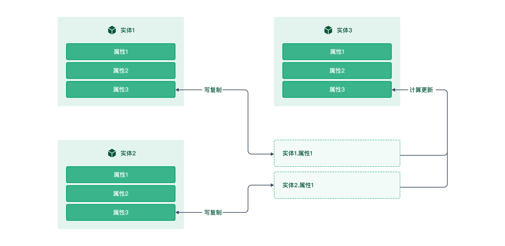

<h1 align="center"> tKeel-Core</h1>
<h5 align="center"> 世界的数字引擎 </h5>
<div align="center">

[](https://goreportcard.com/report/github.com/tkeel-io/core)


[](http://godoc.org/github.com/tkeel-io/core)
</div>

🌰 Core 是 tKeel 物联网平台的数据中心，高性能、可拓展的轻量级下一代数字化数据引擎。

以 *实体（entity）* 为操作单元，通过简易明了的 API 对外提供读写能力（属性读写、时序查询、订阅，映射等）。

[English](README.md)

## 🚪 快速入门
Core 是 [tKeel](https://github.com/tkeel-io/tkeel) 的一个重要基础组件，同时它还有可以单独部署的能力。使用 core 的特性去做伟大的事情，比如说那些你现在正棘手不知道怎么解决的问题，我想也许 core 可以帮助您。

### 安装需要
🔧 在使用 Core 之前请先确保你做足了准备。
1. [Kubernetes](https://kubernetes.io/)
2. [Dapr with k8s](https://docs.dapr.io/getting-started/)


### 通过 tKeel 安装
Core 作为 tKeel 的基础组件，相关 API 的调用均通过 tKeel 代理可以实现。（详细请见 [tKeel CLI 安装文档](https://tkeel-io.github.io/docs/cli )）

### 独立部署
从 Github 拉取该仓库
```bash 
git clone  https://github.com/tkeel-io/core.git
cd core
```
#### Self-hosted
> 1. 请先安装好dapr
> 2. 启动一个etcd 监听127.0.0.1:2379
> 3. 启动一个kafka，监听kafka:9092端口，注意修改hosts
##### 通过 Dapr 启动项目
```bash
dapr run --app-id core --app-protocol http --app-port 6789 --dapr-http-port 3501 --dapr-grpc-port 50002 --log-level debug --components-path ./examples/configs/core0/ -- go run cmd/core/main.go -c ./simple.yml
```
##### 单步调试
使用vscode运行dapr调试
task.json
```json
{
    "version": "2.0.0",
    "tasks": [
        {
            "label": "daprd-debug-go",
            "type": "daprd",
            "appId": "core",
            "componentsPath": "examples/configs/core0",
            "appPort": 6789
        }
    ]
}
```
launch.json
```json
{
    // 使用 IntelliSense 了解相关属性。 
    // 悬停以查看现有属性的描述。
    // 欲了解更多信息，请访问: https://go.microsoft.com/fwlink/?linkid=830387
    "version": "0.2.0",
    "configurations": [
        {
            "name": "Launch file",
            "type": "go",
            "request": "launch",
            "mode": "debug",
            "program": "cmd/core/main.go",
            "args": [
                "-c",
                "../../simple.yml"
            ],
            "console": "integratedTerminal",
            "preLaunchTask": "daprd-debug-go"
        }
    ]
}
```
#### Kubernetes
1. 部署 reids 服务
    ```bash
    helm install redis bitnami/redis
    ```
2. 运行 core 程序
    ```bash
    kubectl apply -f k8s/core.yaml
    ```

## 🪜 架构设计
架构按操作分为分为了两个平面。

- **控制**： 通过 core 向外暴露的 APIs 向 core 发送控制请求（如实体，映射，订阅的创建等）。
- **数据**： 在两个通信服务节点之间建立直连的 [channel](docs/channel/channel.md)，避免由网关和边车带来的长链路路由延迟，实现高性能的数据交互。


<div align="center">


<i> 架构图 </i>
</div>

## 🌱 基本概念
### 实体（Entity）
实体是我们在物联网世界中对 Things 的一种抽象，是 Core 操作的基础对象。包括智能灯、空调、网关，房间，楼层，甚至是通过数据聚合生成的虚拟设备等等，我们将这些 `Things` 进行抽象，
定义为实体。

*属性* 是对某种实体一部分信息的描述。一个实体包含两类属性：
1. **基础属性**: 每个实体都必备的属性，如 `id`，`owner`等用于标识实体共有特征的属性。
2. **扩展属性**: 实体除基础属性外的属性，这种属性属于某一类或某一个实体的特征描述，比如一个 **温度计** 的温度。

更多设计细节请阅读 [实体文档](docs/entity/entity.md)

### Actor
[Actor](docs/actors/actor.md) 是实体（Entity）的运行时的一种模式抽象, 用于维护实体的实时状态以及提供实体的一些具体行为。

### 映射
[映射](docs/mapper/mapper.md) 是实体属性传播的抽象，可以实现数据的向上传递以及控制命令的向下传递。
<div align="center">


<i>映射模拟</i>
</div>

上图中蓝色线条代表数据的上行，如设备数据上报，黑色代表数据的下行，如指令数据的下行。


映射操作的执行包含两步:

1. 写复制: 实现实体属性变更时，将变更向下游实体传递。
2. 计算更新: 对上游实体产生的变更组合计算，然后将计算结果更新到当前实体。


<div align="center">


</div>


### 关系

在物理世界中，实体与实体之间往往不是相互孤立的，它们之间往往存在各式各样的联系，如交换机，路由器，终端设备，服务器通过光纤连接，在网络拓扑图中这些设备实体有`连接关系`。这些关系将这些独立的设备实体链接在一起，组成复杂而精密的网络，向外提供稳定而高速的网络通信服务。当然实体不局限于设备实体，关系也不仅仅局限于 `连接关系`，[更多设计细节请阅读关系文档](docs/relationship/relationship.md)。

### 模型

我们将实体属性的约束集合定义为模型。实体是属性数据的载体，但是如何解析和使用实体的属性数据，我们需要实体属性的描述信息，如类型，取值范围等，我们将这些描述信息称之为 `约束`。而模型就是一个包含`约束`集合的载体，模型也以实体的形式存在， [更多设计细节请阅读模型文档](docs/model/model.md) 。

### 订阅
Core 提供了简捷方便的 [订阅](docs/subscription/subscription.md) ，供开发者实时获取自己关心的数据。

在 tKeel 平台中用于多个 plugin 之间和一个 plugin 内所有以实体为操作对象的数据交换。

底层实现逻辑是这样的：每个 plugin 在注册的时候在 Core 内部自动创建一个交互的 `pubsub`，名称统一为 pluginID-pubsub,
订阅的 `topic` 统一为 pub-core，sub-core，只有 core 与该 plugin 有相关权限
比如
iothub: iothub-pubsub

**订阅** 分为三种：
- **实时订阅**： 订阅会把实体的实时数据发送给订阅者。
- **变更订阅**： 订阅者订阅的实体属性发生变更且满足变更条件时，订阅将实体属性数据发送给订阅者。
- **周期订阅**： 订阅周期性的将实体属性数据发送给订阅者。

### 快速开始
当我们部署了 Core 程序之后，我们就可以直接调用 API 实现对应功能，这里有一份我们精心编写的 [入门文档](https://tkeel-io.github.io/docs/developer_cookbook/core/getting_started)

您可以参考文档的演示内容开始尝试 Core 的功能。 


### 如何在 tKeel 中使用
我们有一个 [hello-core](https://github.com/tkeel-io/quickstarts/tree/main/hello-core), 实例演示项目，为了方便说明，我们采用了外部流量方式访问 **tKeel**，和 Python 作为示例语言的代码。

您可以参考该项目快速了解，一个 [tKeel 插件](https://tkeel-io.github.io/docs/internal_concepts/plugin) 如何使用 Core。

在 _[hello-core](https://github.com/tkeel-io/quickstarts/tree/main/hello-core)_ 实例中我们展示了生成 MQTT 使用的 `token`，**创建实体**，**上报属性**，**获取快照**，**订阅实体的属性** 等功能。

### Entity 示例
因为当前 Dapr SDK 不能处理 HTTP 请求中的 Header，参数通过 path 和 query 的方式传递。

[examples](examples/entity) 该示例中的功能，创建实体，通过 pubsub 更新实体属性，查询实体。

#### 创建实体
```go
    // Source: examples/entity/main.go
    client, err := dapr.NewClient()
    if nil != err {
        panic(err)
    }

    // create entity.
    createUrl := "/entities?id=test1&owner=abc&source=abc&type=device"

    result, err := client.InvokeMethodWithContent(context.Background(), "core", createUrl, "POST", &dapr.DataContent{
        ContentType: "application/json",
    })
    if nil != err {
        panic(err)
    }
    fmt.Println(string(result))
```
#### 更新实体属性
```go
    // Source: examples/entity/main.go
    data := make(map[string]interface{})
	data["entity_id"] = "test1"
	data["owner"] = "abc"
	dataItem := make(map[string]interface{})
	dataItem["core"] = ValueType{Value: 189, Time: time.Now().UnixNano() / 1e6}
	data["data"] = dataItem

	err = client.PublishEvent(context.Background(),
		"client-pubsub",
		"core-pub",
		data,
	)

	if nil != err {
		panic(err)
	}
```
#### 获取实体属性
```go
    // Source: examples/entity/main.go
    getUrl := "/entities/test1?owner=abc&source=abc&type=device"

	result, err = client.InvokeMethodWithContent(context.Background(),
		"core",
		getUrl,
		"GET",
		&dapr.DataContent{
			ContentType: "application/json",
		})
	if nil != err {
		panic(err)
	}
	fmt.Println(string(result))
```

## ⚙️ API
Core 的更多功能 API 详细请参见[ API 文档](https://tkeel-io.github.io/docs/api/Core/tag )

## 💬 一起点亮世界
如果您有任何的建议和想法，欢迎您随时开启一个 [Issue](https://github.com/tkeel-io/core/issues )，期待我们可以一起交流，让世界更美好。

同时 **非常感谢** 您的 `反馈` 与 `建议` ！

[社区文档](docs/development/README.md) 将会带领您了解如何开始为 tKeel 贡献。

### 🙌 贡献一己之力

[开发指南](docs/development/developing-tkeel.md) 向您解释了如何配置您的开发环境。

我们有这样一份希望项目参与者遵守的 [行为准则](docs/community/code-of-conduct.md)。请阅读全文，以便您了解哪些行为会被容忍，哪些行为不会被容忍。

### 🌟 联系我们
提出您可能有的任何问题，我们将确保尽快答复！

| 平台  | 链接             |
| :---- | ---------------- |
| email | tkeel@yunify.com |
| 微博  | [@tkeel]()       |


## 🏘️ 仓库

| 仓库                                            | 描述                                          |
| :---------------------------------------------- | :-------------------------------------------- |
| [tKeel](https://github.com/tkeel-io/tkeel)      | tKeel 开放物联网平台                          |
| [Core](https://github.com/tkeel-io/core)        | tKeel 的数据中心                              |
| [CLI](https://github.com/tkeel-io/cli)          | tKeel CLI 是用于各种 tKeel 相关任务的主要工具 |
| [Helm](https://github.com/tkeel-io/helm-charts) | tKeel 对应的 Helm charts                      |

